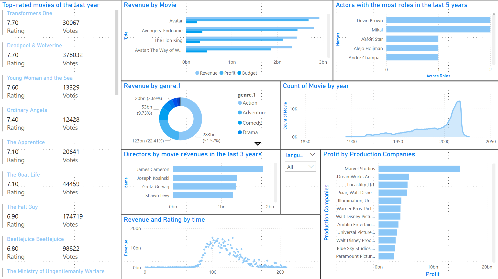
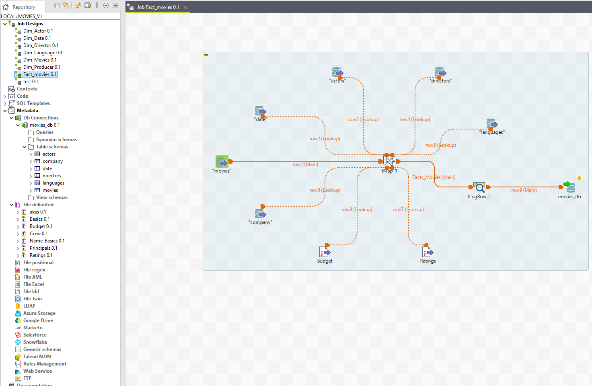

# **ELT Movies Data Warehouse & Analysis Project** 🎬📊

## **Project Overview**
Welcome to the **ELT Movies Data Warehouse and Analysis** project, where data meets cinema! This project demonstrates the entire process of building a data warehouse for movie data, optimized for insightful analysis. By employing **ETL (Extract, Transform, Load)** practices, we transform raw movie data from **IMDb** into actionable insights through a structured database. Visualizations powered by **Power BI** bring these insights to life with interactive and dynamic dashboards.

### **Key Features** 
✨ **ETL Process**:
- **Extract** data from IMDb datasets (titles, crew, ratings).
- **Transform** the data using **Talend** to clean, filter, and aggregate.
- **Load** into a structured database for optimized querying.

📦 **Data Warehouse**:
- **Star Schema Design**: Fact and Dimension tables carefully structured to facilitate seamless querying and analytics.

📊 **Power BI Dashboards**:
- Visual insights into movie trends, top genres, directors, and more.
- Key Performance Indicators (KPIs) like revenue trends, average ratings, and vote counts.

---

## **Technologies Used** 🚀
This project leverages a combination of powerful technologies to streamline the ETL process, optimize data storage, and deliver visually stunning reports:
- **ETL Tool**: [Talend Open Studio](https://www.talend.com) – A robust platform for extracting, transforming, and loading data.
- **Database**: MySQL or PostgreSQL – Popular relational databases for storing and querying large datasets.
- **Visualization Tool**: [Power BI](https://powerbi.microsoft.com) – A Microsoft tool for creating interactive data visualizations.
- **Data Sources**: IMDb's TSV and CSV datasets, including `title.basics.tsv`, `title.akas.tsv`, `title.ratings.tsv`, and more.

---

## **Getting Started** ⚙️

### **Prerequisites** 🔧
To set up this project locally, you will need:
1. **Talend Open Studio**: Download and install [Talend](https://www.talend.com).
2. **Database Setup**: Install either MySQL or PostgreSQL and create a database to hold the transformed data.
3. **Power BI Desktop**: Install the [Power BI Desktop](https://powerbi.microsoft.com/en-us/desktop/).

---

### **Steps to Run** 📋
1. **Set up the ETL Process**:
   - Import Talend jobs from the `/Project/Movies_V1` folder.
   - Execute the jobs to extract, transform, and load the movie data into the database.
   
2. **Connect Power BI**:
   - Open the `Movies_Data.pbix` file in Power BI Desktop.
   - Connect it to your database and refresh the data to start exploring the visualizations.

---

## **Visualizations** 🎨

Experience the power of data visualization! Here are some examples of what you can expect from the **Power BI Dashboard**:

- **Dashboard Overview**: A clean, interactive dashboard summarizing movie statistics.
- **Genre Analysis**: Visualize the popularity of movie genres over time.
- **Director & Production Company Performance**: Insight into the top directors and studios by revenue.

---

## **Dataset Information** 📝

The source data used in this project comes from the **IMDb Datasets**, providing comprehensive details on movie titles, ratings, cast, crew, and much more:
- `title.akas.tsv`
- `title.basics.tsv`
- `title.crew.tsv`
- `title.ratings.tsv`
- **Plus, additional datasets from TMDB** for movie details like budgets and revenue.

---

## **Contributing** 🤝
We welcome contributions to improve this project! Feel free to fork the repository, submit pull requests, or open issues for any improvements or bug fixes.

---

## **Screenshots** 📸
Here's a glimpse of the dynamic visualizations you will work with:

  

